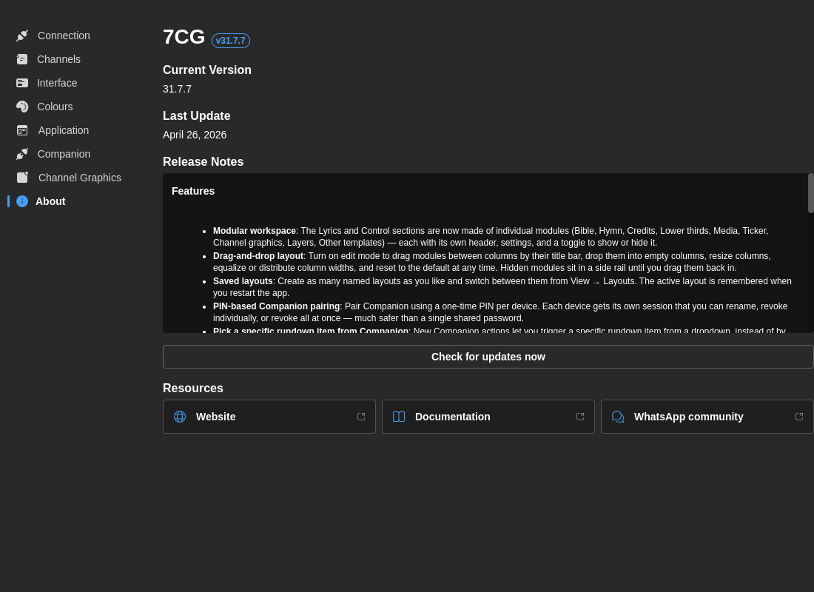

# App Settings

Configure application behavior, updates, and logging.

## Notifications

**Enable Notifications**
- **Default:** Yes
- **Options:** Yes / No
- **Description:** Show toast notifications for errors, warnings, and success messages

## Version Channel

Choose which updates to receive:

- **Normal** - Stable releases only (recommended for production)
- **Beta** - Early access to beta releases with new features

:::warning
Beta versions may contain bugs or incomplete features. Use **Normal** channel for production environments.
:::

## Auto-Update

**Enable Auto-Update**
- **Default:** Yes
- **Options:** Yes / No
- **Description:** Automatically download and install updates when available

When enabled:
- Updates download in the background
- You're notified when an update is ready
- You choose when to install (restart required)

**Manual Update Check:**
- Click **Check for Updates** to manually check for new versions
- Shows "Up to date" toast if no updates available
- Switches to About tab if update is available

## Log Level

Control the verbosity of application logs:

- **Error** - Only critical errors
- **Warn** - Warnings and errors
- **Info** - General information, warnings, and errors (default)
- **Debug** - Detailed debugging information (verbose)

**When to Use:**
- **Production:** Use **Info** or **Warn**
- **Troubleshooting:** Use **Debug** for detailed diagnostics
- **Development:** Use **Debug**

## About

The **About** section in App Settings includes:

- A link to the documentation site (this site)
- A WhatsApp contact for direct support
- App version and build information

External links from the About section open in your default browser rather than inside the 7CG window.

## Reset to Defaults

**Reset All Settings**
- Resets all application preferences to factory defaults
- **Note:** This does not delete your rundowns or database content

:::danger
Resetting preferences will require you to reconfigure your CasparCG connection, channels, and all other settings.
:::
