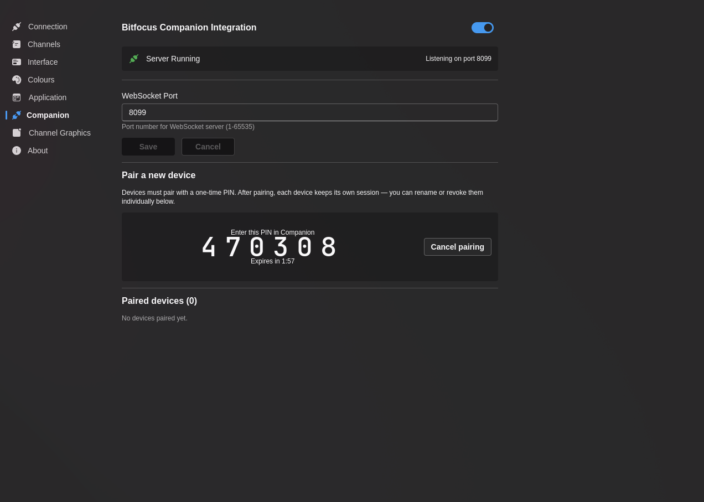

# Companion Integration

Configure the built-in Companion server for integration with **Bitfocus Companion** and compatible control surfaces.

Recent versions of 7CG use **PIN pairing with per-device sessions** instead of a single shared token. This makes it easier to revoke one device without breaking every other controller.

## Server Status

Visual indicator showing current Companion server state:

- **Running** (Green) - WebSocket server is active and accepting connections
- **Stopped** (Gray) - Server is not running

When running, displays: "Listening on port [port number]"

## Settings

**Enable Server**
- **Default:** Disabled
- **Description:** Start/stop the WebSocket server for Companion connections

**WebSocket Port**
- **Default:** `8099`
- **Range:** 1-65535
- **Description:** The port Companion will connect to

## Pairing Workflow

1. Enable the Companion server in 7CG
2. Click **Pair new device**
3. 7CG shows a **6-digit PIN**
4. Enter that PIN in the Companion plugin when pairing the device
5. After a successful handshake, 7CG creates a persistent session for that device
6. Optionally rename the paired device in 7CG so it is easy to identify later

Pairing windows expire automatically after about two minutes and are invalidated after too many wrong PIN attempts.

## Paired Devices

The **Paired devices** table shows:

- Device nickname
- When the device was added
- When it was last seen
- Per-device revoke actions

You can also revoke every device at once and force all controllers to pair again.

## Discovery

When the Companion server is running, 7CG advertises itself on the local network using **mDNS**. Compatible Companion plugins can discover available 7CG instances automatically instead of requiring you to type the IP address manually.

If discovery does not work in your environment, you can still connect by entering the host and port directly.

## Available Actions

Once connected, Companion can trigger 7CG actions such as:

- Execute rundown blocks
- Stop rundown blocks
- Navigate rundown entries
- Execute or stop a **specific rundown item by ID** using a rundown-item dropdown
- Control media playback
- Show or hide lower thirds, credits, QR codes, solid colors, and other block types
- Advance Bible chunks and hymn verses
- Start and stop recorder blocks

:::info
Companion integration enables hardware control surfaces (Stream Deck, X-Keys, etc.) to control 7CG during live productions.
:::

## Broadcast State Exposed to Companion

7CG now broadcasts a broader live state surface so Companion modules can react to what is on air:

- Current and next rundown position
- Full rundown item list for action dropdowns
- Channel graphics bug and ID status
- Recorder state
- Active media clips
- Lower third, ticker, and credits visibility
- Bible and hymn progression state

This is what enables richer Companion feedbacks, variables, and auto-populated action choices.

## Typical Setup

1. Open **Preferences → Companion**
2. Enable the server and confirm the port
3. Pair each device individually
4. Name each paired device after its physical surface or operator
5. In Companion, bind buttons to either:
   - selected-item rundown actions for simple control
   - specific-item actions when the button should always target one rundown entry
6. Test reconnect behavior before going live

## Troubleshooting

### Companion Not Connecting

1. Verify Companion server is enabled in 7CG
2. Check that WebSocket port (default 8099) is not blocked by firewall
3. If using manual connection, ensure Companion is configured with the correct hostname/IP and port
4. If using PIN pairing, confirm the PIN has not expired
5. Start a new pairing window if the current one timed out or was invalidated
6. Revoke and re-pair the affected device if its saved session is no longer valid
7. Try disabling and re-enabling the Companion server
8. Check for port conflicts with other applications

### Discovery Is Not Working

1. Confirm the Companion server is running
2. Ensure both machines are on the same local network
3. Check whether mDNS or multicast traffic is filtered on your network
4. Fall back to manual host and port entry if needed
