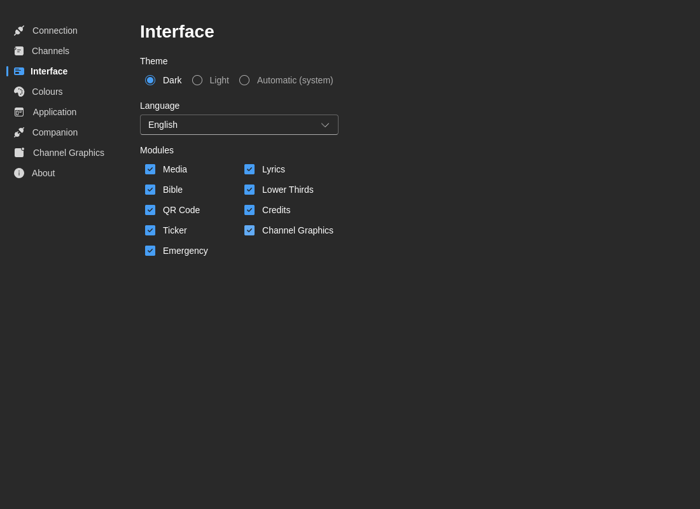

# Interface

Customize the visual appearance and the modules that operators see in the main workspace.

## Theme

Choose your preferred color scheme:

- **Dark** - Dark theme optimized for low-light environments
- **Light** - Light theme for bright environments
- **System** - Follow your operating system's theme preference

:::tip Best Practice
Most broadcast environments use **Dark** theme to reduce eye strain during long production hours.
:::

## Language

Select your preferred interface language:

- **English** (en)
- **Português** (pt) - Portuguese
- **Español** (es) - Spanish

Language changes apply immediately to all interface elements, including:
- Menu items and buttons
- Dialog boxes
- Status messages
- Form labels

## Modules

Control visibility of specific modules and features:

- **Media** - Video, image, and audio playback
- **Lyrics** - Song lyrics and hymnal system
- **Hymn** - Dedicated hymn block module
- **Bible** - Scripture display
- **Lower Thirds** - Name and title graphics
- **QR Code** - QR code generator blocks
- **Credits** - Production credits and acknowledgments
- **Ticker** - Scrolling text ticker
- **Channel Graphics** - Channel-specific graphics
- **Layers** - Live view of CasparCG layers in use
- **Emergency** - Emergency alert system

Module visibility changes apply immediately and are useful for simplifying the interface for a given operator or event.

## How Interface Visibility Relates to Layouts

Interface visibility and layout customization are related, but they are not the same thing:

- **Interface → Modules** controls whether a module is available at all
- **Layouts** controls where visible modules are placed, hidden temporarily, or grouped into saved presets

If you need to rearrange columns, hide modules temporarily, or save role-specific workspaces, see [Layouts](./layouts.md).

## Operator Recommendations

Some common setups:

- **Lyrics operator** - Keep Lyrics, Bible, Rundown, and Media visible
- **Graphics operator** - Keep Lower Thirds, Channel Graphics, Credits, and Rundown visible
- **Technical director** - Keep most modules visible and use layout presets for different show phases

## Notes

- Theme changes apply across the application
- Language changes are immediate
- Module visibility is stored per installation and persists across restarts
