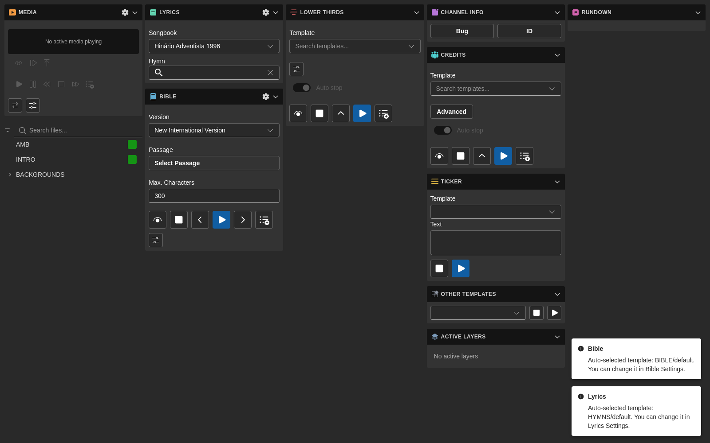
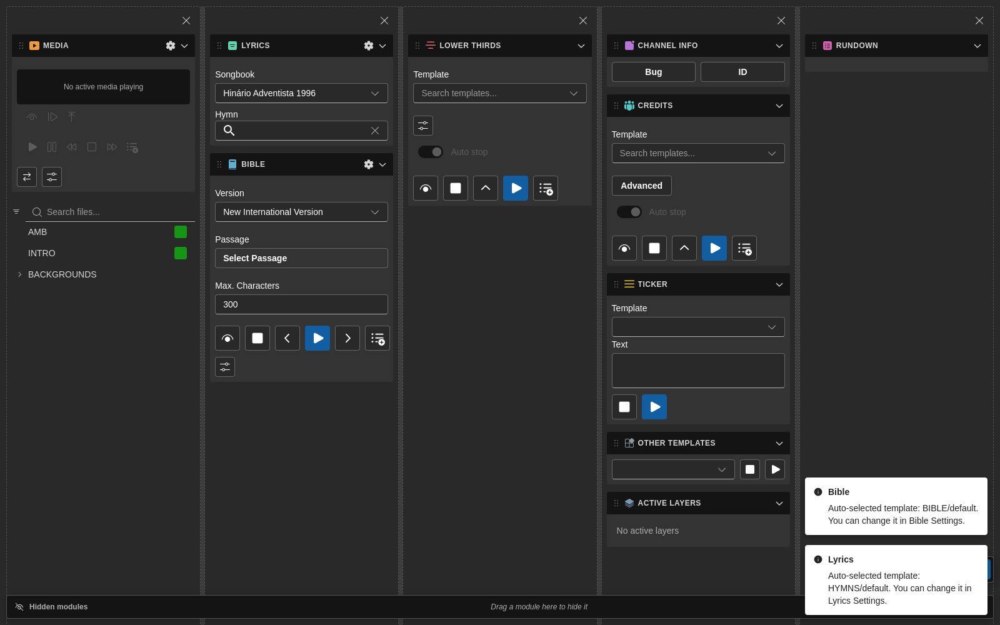

# Layouts

7CG includes a customizable workspace so operators can rearrange the main modules to match the production workflow.

## What You Can Customize

In layout edit mode you can:

- Drag modules between columns
- Reorder modules within a column
- Add and remove columns
- Resize columns
- Hide modules temporarily by dragging them to the hidden-modules rail
- Restore hidden modules
- Reset the workspace to the default layout
- Distribute all columns equally

## Entering Layout Edit Mode

Use the layout customization controls in the main workspace to enter edit mode.

When edit mode is active, 7CG shows:

- Drag handles for modules
- Column removal controls
- Empty-column drop targets
- A floating toolbar with layout actions
- A hidden-modules rail for temporarily removing modules from the visible workspace

Modules dragged out of the workspace land in the hidden-modules rail on the side, where they wait until you drag them back in:

## Saved Layout Presets

Recent versions of 7CG support **named layout presets**.

This is useful when you want different workspaces for:

- Rehearsal versus live service
- Morning service versus concert
- Graphics operator versus lyrics operator
- Compact laptop operation versus multi-monitor setups

## Saving a Layout

You can save the current workspace arrangement from either:

- The layout edit toolbar
- **View → Layouts** in the application menu

When saving, give the layout a clear name such as:

- `Sunday AM`
- `Lyrics Operator`
- `Compact Laptop`

If you save using an existing name, 7CG asks whether the preset should be overwritten.

## Managing Layouts

The **Manage layouts** dialog lets you:

- Apply a saved layout
- Rename a preset
- Delete a preset

The application menu updates dynamically as presets are added or removed, so operators can switch layouts quickly.

## Recommended Workflow

1. Enable only the modules you need in [Interface](./interface.md)
2. Enter layout edit mode
3. Arrange modules into task-focused columns
4. Hide modules that are only needed occasionally
5. Save the result as a named preset
6. Repeat for each operator role or show type

## Best Practices

- Keep the **Rundown** module wide enough for labels, status, and block actions
- Group related modules together, such as **Lyrics + Bible** or **Channel Graphics + Credits**
- Save a fallback preset that resembles the default layout
- Create simple presets for volunteers and more detailed presets for technical operators

## Resetting

Use **Reset** if the current layout becomes confusing or if you want to start over from the default workspace.

:::warning
Resetting the current layout returns the active workspace to its defaults. Save a preset first if you want to keep your custom arrangement.
:::
