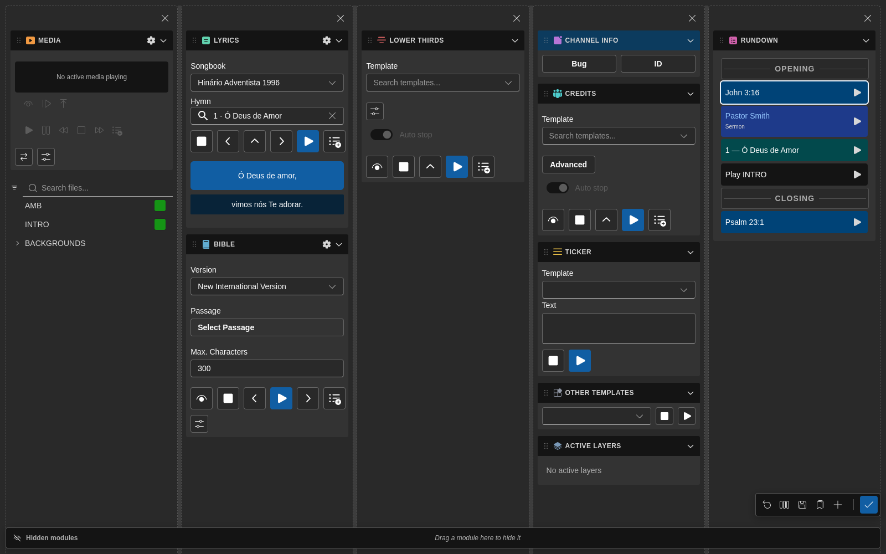

# Rundown Module

The **Rundown** module is where you organize and execute the sequence of items for a live production.

It is also the source of several newer workflows in `7cg-ng`, including Companion item targeting and video export.

## What the Rundown Does

The rundown lets you:

- Arrange show items in order
- Select the current item
- Execute and stop supported items
- Track the current and next position
- Edit labels and item details
- Trigger blocks from Companion
- Export supported items to video

## Typical Workflow

1. Add or create the items you need
2. Arrange them in production order
3. Select the next item to air
4. Execute it from 7CG or Companion
5. Stop or clear it when appropriate
6. Continue to the next item

## Editing

### Undo and Redo

Rundown changes — adding, removing, reordering, or editing blocks — are tracked in an undo history.

- **Undo:** `Ctrl+Z` (`Cmd+Z` on macOS)
- **Redo:** `Ctrl+Shift+Z`

### Per-Block Transitions

Each block can use its own transition type and duration, configured from the block's edit dialog. Transition icons and labels are translated, so operators see the same names in the language they've chosen.

If a block has no transition override, the channel's default transition is used.

### Per-Block Edit Dialogs

Several block types now have dedicated edit dialogs:

- **Hymn** blocks expose a per-block "lines per display" override so a single hymn can break differently from the global Lyrics setting (see also [Lyrics module](./lyrics.md)).

- **Command** blocks have their own edit dialog with media handling, so command-driven media files are picked and previewed in the same place as the command itself.
- **Lower-third** blocks get a focused edit dialog for the on-air name and subtitle fields, with an Advanced section for transition and routing tweaks.
- **Bible** blocks let you set template properties per block, overriding the module-wide defaults for that one moment in the rundown (see also [Bible module](./bible.md)).
- **Separator** blocks edit a single Title field — they're visual section markers in the rundown, not playback blocks.

### Per-Block Actions

Right-click any rundown row to open the context menu — Set Label, Edit, Delete, Duplicate, Export video, and Color are all available per block.

## Companion Integration

Recent versions of 7CG expose more rundown-aware Companion features.

### Selected-Item Actions

These actions operate on whatever item is currently selected in 7CG:

- Execute selected item
- Stop selected item
- Select next item
- Select previous item

### Specific-Item Actions

7CG now also exposes Companion actions that target a **specific rundown item by ID**:

- **Execute rundown item…**
- **Stop rundown item…**

These actions are useful when a button should always fire the same item, regardless of what is selected in the UI.

Because the binding uses a stable item ID, renaming or reordering the item does not break the button. If the item is removed from the rundown, Companion receives a clear "not found" error instead of failing silently.

## Rundown State Broadcasts

7CG publishes rundown state to Companion so panels and feedbacks can stay in sync:

- Current item
- Next item
- Current position index
- Total item count
- Full rundown item list for action dropdowns

This makes it easier to build operator-friendly Companion pages without hard-coding labels manually.

## Export Video

The Rundown module can export supported items as a `.mov` file.

### Export Workflow

When exporting an item:

1. Choose a filename ending in `.mov`
2. Set the duration in seconds
3. Confirm the target channel if applicable
4. Start the export
5. Watch the progress bar and remaining time
6. Use **Stop** if you need to cancel the export mid-recording

### What Happens During Export

7CG handles more than a simple "play and record" flow:

- A short preroll is added before playback
- A tail is recorded after stopping so transitions are captured cleanly
- The dialog stays open while recording to prevent orphaned recorder sessions
- Bible and hymn exports can cycle through their chunks or verse groups during the export duration instead of staying on only the first chunk

### Canceling an Export

If the wrong item, duration, or filename was chosen, use the **Stop** button in the export dialog. 7CG cancels the recording and performs the necessary cleanup so CasparCG does not keep recording in the background.

## Best Practices

- Keep item labels clear so both operators and Companion users can recognize them quickly
- Group related items together in the order they will air
- Test exports ahead of time for templates that rely on multiple chunks or verses
- Use block colors to make rundown scanning faster under pressure

## Related Pages

- [Companion Integration](../configuration/companion.md)
- [Block Colors](../configuration/block-colors.md)
- [Media Module](./media.md)
