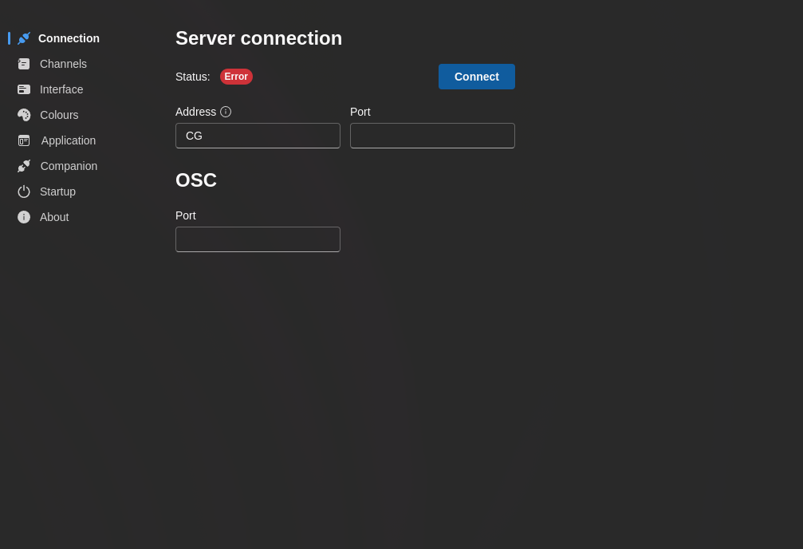

# Quick Start

Get up and running with 7CG in minutes.

## Installation

1. Download 7CG from the [official website](https://7cg.live)
2. Install the application for your platform (Windows, macOS, or Linux)
3. Launch 7CG

## First Run Wizard

When you first launch 7CG, a setup wizard will guide you through initial configuration.

### 1. Welcome

The wizard welcomes you to 7CG. Click **Get Started** to begin setup.

<!-- Screenshot: Welcome screen -->

### 2. Language Selection

Choose your preferred interface language:
- English
- Português
- Español

Your selection will be applied immediately and will pre-select a matching Bible translation.

<!-- Screenshot: Language selection screen -->

### 3. Theme Selection

Select your preferred visual theme:
- **Light** - Light color scheme
- **Dark** - Dark color scheme
- **System** - Follows your operating system theme

<!-- Screenshot: Theme selection screen -->

### 4. Bible & Songbook

Configure your default content sources:

- **Bible Translation** - Select your preferred Bible version (filtered by your chosen language)
- **Songbook** - Choose your default songbook for lyrics

<!-- Screenshot: Bible and Songbook selection screen -->

### 5. Notifications

Enable or disable desktop notifications to stay informed about:
- Update availability
- Import completions
- System alerts

<!-- Screenshot: Notifications preferences screen -->

## Connecting to CasparCG

After completing the wizard, you'll be directed to the connection settings:

1. Open **Preferences** (automatically opens after wizard)
2. Navigate to the **Connection** tab
3. Enter your CasparCG Server details:
   - Host address (e.g., `localhost` or `192.168.1.100`)
   - Port (default: `5250`)
4. Click **Connect** to verify
5. You can check if your channels were properly brought in from the server on the **Channels** tab.

See the [Connection Configuration](./configuration/connection.md) guide for detailed setup instructions.

## Creating Your First Rundown

Once connected to CasparCG:

1. Click **New Rundown** in the main window
2. Add blocks by clicking the **+** button or right-clicking in the rundown
3. Configure block content and CasparCG settings
4. Click a block to select it, then press **Play** to execute

For more details, see the [Configuration](./configuration/index.md) section.

## Next Steps

- Explore [configuration options](./configuration/index.md) to customize your workflow
- Learn about available [modules](./modules/index.md) for different content types
- Check [troubleshooting](./configuration/troubleshooting.md) if you encounter issues
