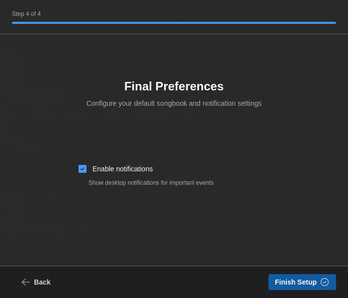

# Quick Start

Get up and running with 7CG in minutes.

## Installation

1. Download 7CG from the [official website](https://7cg.live)
2. Install the application for your platform (Windows, macOS, or Linux)
3. Launch 7CG

## First Run Wizard

When you first launch 7CG, a setup wizard will guide you through initial configuration.

### 1. Welcome

The wizard welcomes you to 7CG. Click **Get Started** to begin setup.

<!-- Screenshot: Welcome screen -->

### 2. Language Selection

Choose your preferred interface language:
- English
- Português
- Español

Your selection is applied immediately and is used to pre-filter the default Bible translation list later in the wizard.

<!-- Screenshot: Language selection screen -->

### 3. CasparCG Connection

Configure the CasparCG server connection used by 7CG:

- **Server IP / Hostname** - For example `127.0.0.1`, `localhost`, or the hostname of your CasparCG machine
- **Server Port** - AMCP port, normally `5250`
- **Test Connection** - Verifies the server is reachable before continuing

If you are not ready to connect yet, you can skip this step and configure it later in **Preferences → Connection**.

<!-- Screenshot: Theme selection screen -->

### 4. Theme Selection

Select your preferred visual theme:
- **Light** - Light color scheme
- **Dark** - Dark color scheme
- **System** - Follows your operating system theme

### 5. Bible & Songbook

Configure your default content sources:

- **Bible Translation** - Select your preferred Bible version (filtered by your chosen language)
- **Songbook** - Choose your default songbook for lyrics

<!-- Screenshot: Bible and Songbook selection screen -->

### 6. Other Preferences

The final wizard step captures a few operational defaults:

- **Notifications** - Enable desktop notifications for updates, imports, and important status messages
- **Auto-play channel bug on startup** - Starts your bug overlay automatically when 7CG launches
- **Auto-play channel ID on startup** - Starts your channel ID overlay automatically when 7CG launches

Those startup overlays are configured in detail later in **Preferences → Channel Graphics**.

<!-- Screenshot: Other preferences screen -->

## After the Wizard

When setup finishes, 7CG opens the main application and you can refine your preferences from the settings panel:

- **Connection** - CasparCG host, AMCP port, OSC port
- **Channels** - Discover and label CasparCG channels
- **Interface** - Theme, language, and module visibility
- **Companion** - Enable the server and pair devices with a PIN
- **Channel Graphics** - Configure bug and ID overlays, channel/layer targets, and autoplay
- **TV Manager** - Cloud rundown integration

## Connecting to CasparCG Later

If you skipped connection testing during the wizard:

1. Open **Preferences**
2. Navigate to **Connection**
3. Enter your CasparCG server details:
   - Host address, such as `localhost` or `192.168.1.100`
   - Port, normally `5250`
4. Click **Connect**
5. Open **Channels** to confirm 7CG can discover and label the server channels correctly

See the [Connection Configuration](./configuration/connection.md) guide for detailed setup instructions.

## Optional Next Setup Tasks

Before your first live production, it is worth checking three areas:

- [Channel Graphics](./configuration/channel-graphics.md) to configure startup bug and ID overlays
- [Companion Integration](./configuration/companion.md) to pair Stream Deck or Companion devices
- [Layouts](./configuration/layouts.md) to tailor the workspace for each operator or production type

## Creating Your First Rundown

Once connected to CasparCG:

1. Open or create a rundown in the **Rundown** module
2. Add blocks from the modules or from the rundown creation actions
3. Configure content and routing settings
4. Select an item and press **Play** to execute it
5. Use **Stop** when the block type supports stopping or clearing on-air output

For more details, see the [Rundown Module](./modules/rundown.md) and [Configuration](./configuration/index.md) sections.

## Next Steps

- Explore [configuration options](./configuration/index.md) to customize your workflow
- Learn about available [modules](./modules/index.md) for different content types
- Check [troubleshooting](./configuration/troubleshooting.md) if you encounter issues
