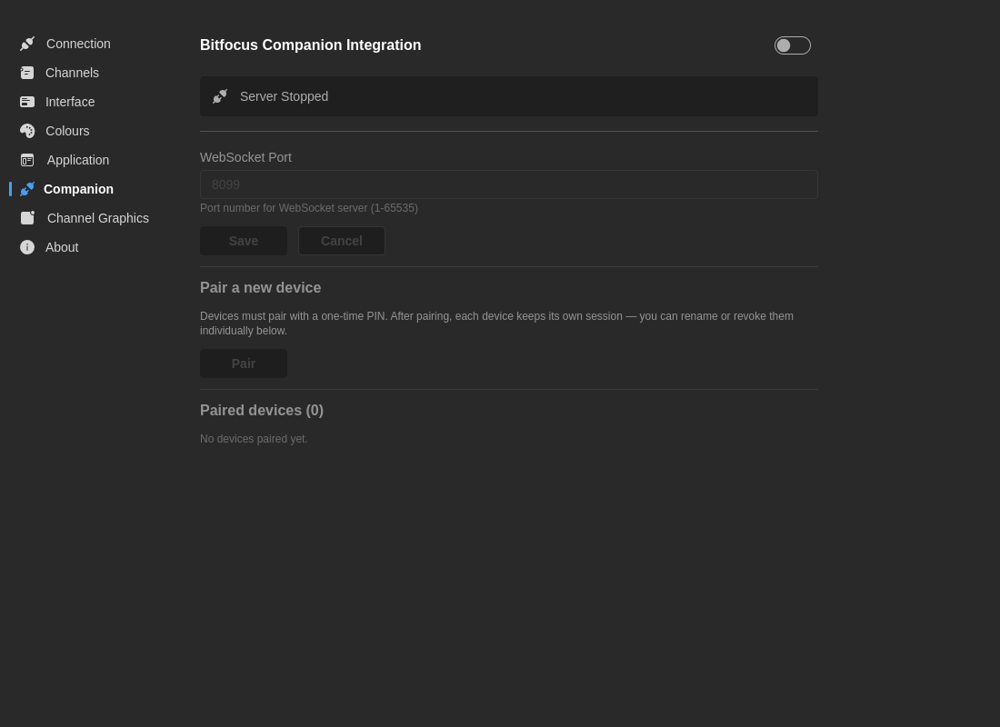

# Integración con Companion

Configura el servidor Companion integrado para integración con **Bitfocus Companion** y superficies de control compatibles.

Las versiones recientes de 7CG usan **emparejamiento por PIN con sesiones por dispositivo** en lugar de un único token compartido. Esto facilita revocar un dispositivo sin romper los demás controladores.

## Estado del servidor

Indicador visual del estado actual del servidor Companion:

- **En ejecución** (Verde) — El servidor WebSocket está activo y aceptando conexiones
- **Detenido** (Gris) — El servidor no está en ejecución

Cuando está en ejecución, muestra: "Escuchando en el puerto [número]"

## Ajustes

**Activar servidor**
- **Predeterminado:** Desactivado
- **Descripción:** Inicia/detiene el servidor WebSocket para conexiones Companion

**Puerto WebSocket**
- **Predeterminado:** `8099`
- **Rango:** 1-65535
- **Descripción:** El puerto al que se conectará Companion

## Flujo de emparejamiento

1. Activa el servidor Companion en 7CG
2. Haz clic en **Emparejar nuevo dispositivo**
3. 7CG muestra un **PIN de 6 dígitos**
4. Introduce ese PIN en el plugin de Companion al emparejar el dispositivo
5. Tras un handshake exitoso, 7CG crea una sesión persistente para ese dispositivo
6. Opcionalmente, renombra el dispositivo emparejado en 7CG para identificarlo más tarde

Las ventanas de emparejamiento expiran automáticamente tras unos dos minutos y se invalidan tras demasiados intentos de PIN erróneos.

## Dispositivos emparejados

La tabla **Dispositivos emparejados** muestra:

- Alias del dispositivo
- Cuándo se añadió
- Cuándo se vio por última vez
- Acciones de revocación por dispositivo

También puedes revocar todos los dispositivos a la vez y forzar a todos los controladores a emparejarse de nuevo.

## Descubrimiento

Cuando el servidor Companion está en ejecución, 7CG se anuncia en la red local mediante **mDNS**. Los plugins compatibles pueden descubrir instancias de 7CG automáticamente sin tener que escribir la dirección IP a mano.

Si el descubrimiento no funciona en tu entorno, puedes conectarte introduciendo el host y el puerto directamente.

## Acciones disponibles

Una vez conectado, Companion puede disparar acciones de 7CG como:

- Ejecutar bloques del rundown
- Detener bloques del rundown
- Navegar entre entradas del rundown
- Ejecutar o detener un **elemento concreto del rundown por ID** mediante una lista desplegable
- Controlar la reproducción de medios
- Mostrar u ocultar tercios inferiores, créditos, códigos QR, colores sólidos y otros tipos de bloque
- Avanzar fragmentos de la Biblia y versículos de himnos
- Iniciar y detener bloques de grabador

:::info
La integración con Companion permite que las superficies de control físicas (Stream Deck, X-Keys, etc.) controlen 7CG durante producciones en vivo.
:::

## Estado de transmisión expuesto a Companion

7CG ahora transmite una superficie de estado en vivo más amplia para que los módulos de Companion puedan reaccionar a lo que está al aire:

- Posición actual y siguiente del rundown
- Lista completa de elementos del rundown para listas desplegables de acciones
- Estado del bug y del ID en Información del Canal
- Estado del grabador
- Clips de medios activos
- Visibilidad de tercios inferiores, ticker y créditos
- Progresión de Biblia e himnos

Esto es lo que habilita feedbacks más ricos, variables y elecciones de acción autocompletadas en Companion.

## Configuración típica

1. Abre **Preferencias → Companion**
2. Activa el servidor y confirma el puerto
3. Empareja cada dispositivo individualmente
4. Nombra cada dispositivo emparejado según la superficie física o el operador
5. En Companion, asigna botones a:
   - acciones de "elemento seleccionado" del rundown para control sencillo
   - acciones de "elemento concreto" cuando el botón deba apuntar siempre a una entrada específica
6. Prueba el comportamiento de reconexión antes de salir al aire

## Resolución de problemas

### Companion no se conecta

1. Verifica que el servidor Companion está activado en 7CG
2. Comprueba que el puerto WebSocket (predeterminado 8099) no está bloqueado por el firewall
3. Si usas conexión manual, verifica que Companion está configurado con el host/IP y puerto correctos
4. Si usas emparejamiento por PIN, confirma que el PIN no ha expirado
5. Inicia una nueva ventana de emparejamiento si la actual ha expirado o se ha invalidado
6. Revoca y vuelve a emparejar el dispositivo afectado si la sesión guardada ya no es válida
7. Prueba a desactivar y reactivar el servidor Companion
8. Comprueba conflictos de puerto con otras aplicaciones

### El descubrimiento no funciona

1. Confirma que el servidor Companion está en ejecución
2. Asegúrate de que ambas máquinas están en la misma red local
3. Comprueba si el tráfico mDNS o multicast está filtrado en tu red
4. Recurre a la introducción manual de host y puerto si es necesario
