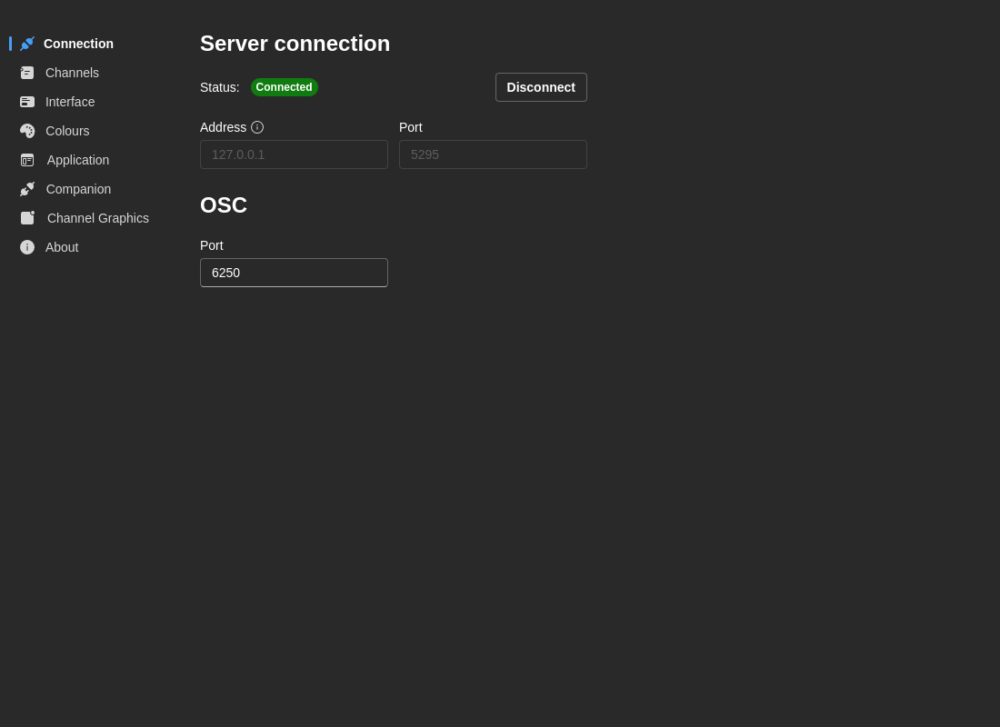

# Conexión

Configura la conexión al servidor CasparCG y los ajustes OSC.

## Conexión al servidor

**Dirección del servidor**
- **Predeterminado:** `CG` (nombre de host)
- **Descripción:** El nombre de host o dirección IP del servidor CasparCG
- **Ejemplos:**
  - `localhost` — Servidor en la misma máquina
  - `CG` — Servidor con nombre "CG" en la red local
  - `192.168.1.100` — Dirección IP directa

**Puerto del servidor**
- **Predeterminado:** `5250`
- **Descripción:** El puerto AMCP en el que escucha CasparCG
- **Rango:** 1-65535
- **Nota:** Es el puerto AMCP (Advanced Media Control Protocol) estándar de CasparCG

## Estado de la conexión

El panel muestra el estado en tiempo real:
- **Conectado** (Verde) — Conectado correctamente al servidor CasparCG
- **Desconectado** (Rojo) — Sin conexión al servidor
- **Reconectando** (Amarillo) — Intentando restablecer la conexión
- **Error** (Rojo) — Conexión fallida con error

Las etiquetas de estado incluyen la dirección del servidor al que estás conectado (por ejemplo, `Conectado a CG:5250`), de modo que está claro de un vistazo cuál es el servidor activo.

### Franja de conexión global

Mientras la aplicación se conecta o reconecta, aparece una franja animada en la parte superior de la pantalla como indicador global — visible desde cualquier vista, no solo desde el panel de Conexión. La franja desaparece cuando la conexión está sana.

**Acciones:**
- **Conectar** — Establece la conexión con los ajustes actuales
- **Desconectar** — Cierra la conexión activa
- **Pulsar Enter** — Conexión rápida al editar los campos

## Ajustes OSC

**Puerto OSC**
- **Predeterminado:** `6250`
- **Descripción:** Puerto para comunicación OSC (Open Sound Control)
- **Rango:** 1-65535
- **Caso de uso:** Para integración con superficies de control externas y sistemas de automatización

:::tip
Los cambios en la dirección y el puerto del servidor se guardan al hacer clic en **Conectar**. Los cambios al puerto OSC se guardan de inmediato.
:::

## Resolución de problemas

### No puedo conectar a CasparCG

1. Verifica que el servidor CasparCG está en ejecución
2. Comprueba la dirección y el puerto en la pestaña Conexión
3. Prueba la conectividad de red: `ping [dirección-del-servidor]`
4. Asegúrate de que el firewall permite el puerto 5250 (o tu puerto personalizado)
5. Revisa los registros del servidor CasparCG
