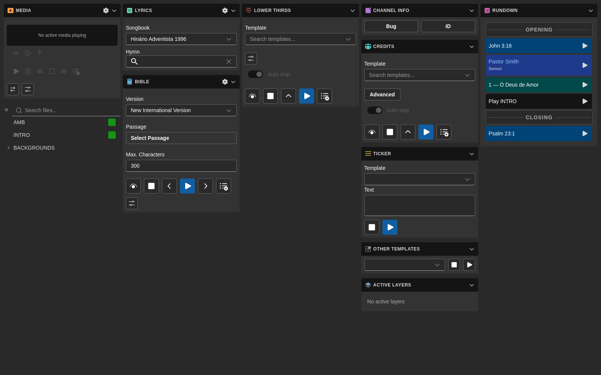
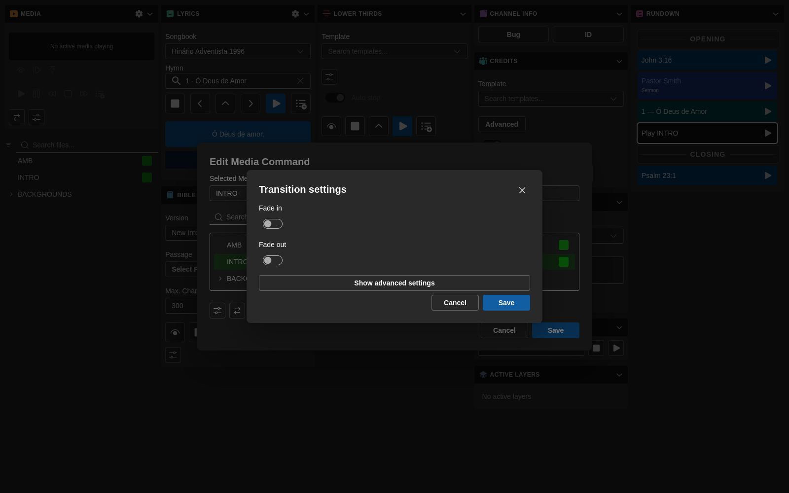
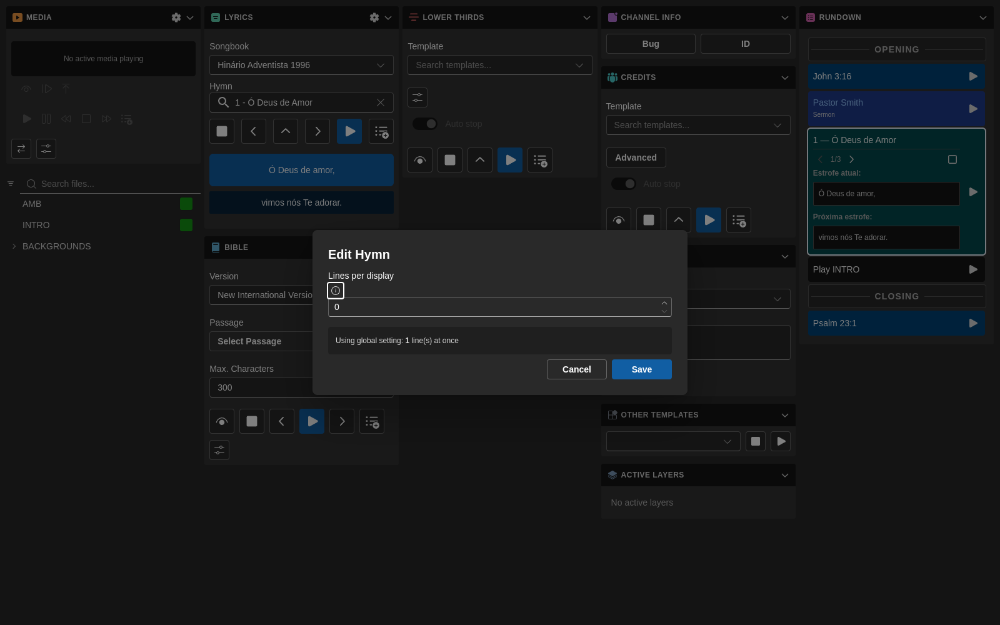
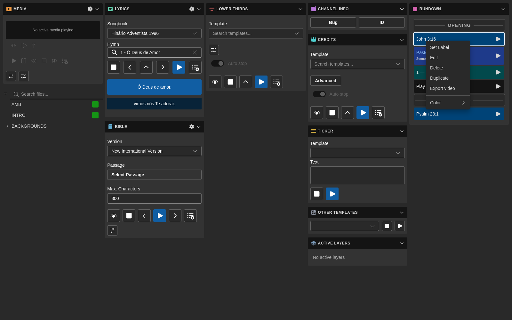

# Módulo Rundown

El módulo **Rundown** es donde organizas y ejecutas la secuencia de elementos de una producción en vivo.

También es el origen de varios flujos más recientes en `7cg-ng`, incluyendo el disparo de elementos específicos desde Companion y la exportación a vídeo.

## Qué hace el Rundown

El rundown te permite:

- Organizar los elementos del programa en orden
- Seleccionar el elemento actual
- Ejecutar y detener elementos compatibles
- Seguir la posición actual y la siguiente
- Editar etiquetas y detalles de elementos
- Disparar bloques desde Companion
- Exportar elementos compatibles a vídeo

## Flujo típico

1. Añade o crea los elementos que necesites
2. Organízalos por orden de producción
3. Selecciona el siguiente elemento al aire
4. Ejecútalo desde 7CG o desde Companion
5. Detén o limpia cuando corresponda
6. Continúa con el siguiente elemento

## Edición

### Deshacer y rehacer

Los cambios al rundown — añadir, eliminar, reordenar o editar bloques — quedan registrados en un historial de deshacer.

- **Deshacer:** `Ctrl+Z` (`Cmd+Z` en macOS)
- **Rehacer:** `Ctrl+Shift+Z`

### Transiciones por bloque

Cada bloque puede usar su propio tipo y duración de transición, configurados en el cuadro de edición del bloque. Los iconos y etiquetas de transición están traducidos, por lo que los operadores ven los mismos nombres en el idioma elegido.

Si un bloque no tiene una sustitución, se usa la transición predeterminada del canal.

### Cuadros de edición por bloque

Varios tipos de bloque tienen ahora cuadros de edición dedicados:

- Los bloques de **Himno** exponen una sustitución de "líneas por pantalla" por bloque, para que un himno concreto pueda dividirse de forma distinta al ajuste global de Letras (consulta también el [módulo Letras](./lyrics)).

- Los bloques de **Comando** tienen su propio cuadro de edición con gestión de medios, de modo que los archivos relacionados con el comando se eligen y previsualizan en el mismo sitio.
- Los bloques de **Tercio Inferior** tienen un cuadro de edición centrado en los campos de nombre y subtítulo, con una sección Avanzado para ajustes de transición y enrutamiento.
- Los bloques de **Biblia** permiten definir propiedades de plantilla por bloque, sobrescribiendo los valores del módulo solo para ese momento del rundown (consulta también el [módulo Biblia](./bible)).
- Los bloques **Separador** editan solo un campo Título — son marcadores visuales de sección, no bloques de reproducción.

### Acciones por bloque

Haz clic derecho en cualquier fila del rundown para abrir el menú contextual — Establecer etiqueta, Editar, Eliminar, Duplicar, Exportar vídeo y Color están disponibles por bloque.

## Integración con Companion

Versiones recientes de 7CG exponen más funciones de Companion conscientes del rundown.

### Acciones sobre el elemento seleccionado

Estas acciones operan sobre el elemento que esté seleccionado en 7CG:

- Ejecutar elemento seleccionado
- Detener elemento seleccionado
- Seleccionar siguiente
- Seleccionar anterior

### Acciones sobre elemento específico

7CG ahora expone acciones de Companion que apuntan a un **elemento específico del rundown por ID**:

- **Ejecutar elemento del rundown…**
- **Detener elemento del rundown…**

Útiles cuando un botón debe disparar siempre el mismo elemento, independientemente de lo que esté seleccionado en la UI.

Como la asignación usa un ID estable, renombrar o reordenar el elemento no rompe el botón. Si el elemento se elimina del rundown, Companion recibe un error claro "no encontrado" en lugar de fallar silenciosamente.

## Transmisión del estado del rundown

7CG publica el estado del rundown a Companion para que los paneles y feedbacks se mantengan sincronizados:

- Elemento actual
- Siguiente elemento
- Índice de la posición actual
- Total de elementos
- Lista completa de elementos para las listas desplegables de acción

Esto facilita construir páginas de Companion fáciles para el operador sin tener que codificar las etiquetas a mano.

## Exportar vídeo

El módulo Rundown puede exportar elementos compatibles como archivo `.mov`.

### Flujo de exportación

Al exportar un elemento:

1. Elige un nombre de archivo terminado en `.mov`
2. Establece la duración en segundos
3. Confirma el canal de destino si aplica
4. Inicia la exportación
5. Observa la barra de progreso y el tiempo restante
6. Usa **Detener** si necesitas cancelar la exportación a mitad

### Qué ocurre durante la exportación

7CG hace más que un simple "reproducir y grabar":

- Se añade un breve preroll antes de la reproducción
- Se graba una cola tras el stop para capturar transiciones correctamente
- El cuadro permanece abierto durante la grabación para evitar sesiones de grabador huérfanas
- Las exportaciones de Biblia e himno pueden ciclar por sus fragmentos o grupos de versículos durante la duración de la exportación, en lugar de quedarse solo en el primero

### Cancelar una exportación

Si se eligió mal el elemento, duración o nombre, usa el botón **Detener** en el cuadro de exportación. 7CG cancela la grabación y realiza la limpieza necesaria para que CasparCG no siga grabando en segundo plano.

## Buenas prácticas

- Mantén etiquetas claras para que operadores y usuarios de Companion las reconozcan rápido
- Agrupa elementos relacionados en el orden en que saldrán al aire
- Prueba las exportaciones con antelación para plantillas que dependen de varios fragmentos o versículos
- Usa colores de bloque para hacer la lectura del rundown más rápida bajo presión

## Páginas relacionadas

- [Integración con Companion](../configuration/companion)
- [Colores de bloques](../configuration/block-colors)
- [Módulo Medios](./media)
