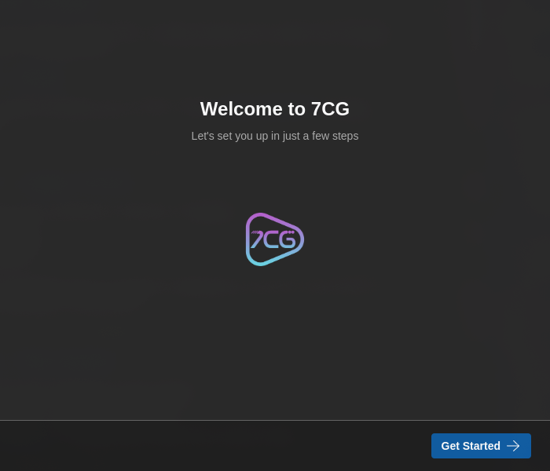
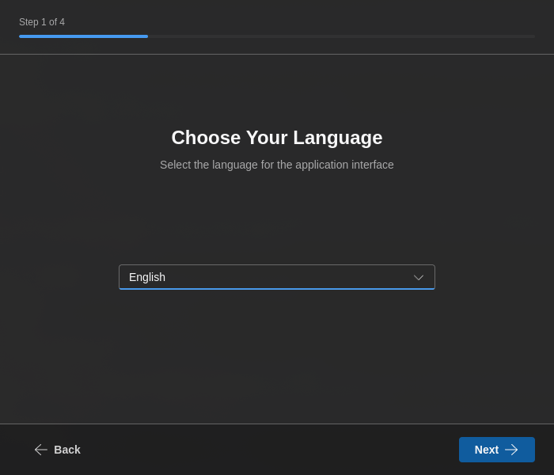

# Inicio rápido

Empieza a usar 7CG en pocos minutos.

## Instalación

1. Descarga 7CG desde el [sitio oficial](https://7cg.live)
2. Instala la aplicación para tu plataforma (Windows, macOS o Linux)
3. Inicia 7CG

## Asistente de primera ejecución

Cuando inicias 7CG por primera vez, un asistente de configuración te guía por los pasos iniciales.

### 1. Bienvenida

El asistente te da la bienvenida a 7CG. Haz clic en **Empezar** para comenzar la configuración.

{/* Screenshot: Welcome screen */}

### 2. Selección de idioma

Elige el idioma preferido para la interfaz:
- English
- Português
- Español

La selección se aplica de inmediato y se usa para prefiltrar la lista de traducciones bíblicas más adelante en el asistente.

{/* Screenshot: Language selection screen */}

### 3. Conexión a CasparCG

Configura la conexión al servidor CasparCG que usará 7CG:

- **IP / nombre del servidor** — por ejemplo `127.0.0.1`, `localhost`, o el nombre de la máquina donde corre CasparCG
- **Puerto del servidor** — puerto AMCP, normalmente `5250`
- **Probar conexión** — verifica que el servidor sea accesible antes de continuar

Si aún no estás listo para conectarte, puedes saltarte este paso y configurarlo más tarde en **Preferencias → Conexión**.

{/* Screenshot: Theme selection screen */}

### 4. Selección de tema

Elige tu tema visual preferido:
- **Claro** — esquema de colores claro
- **Oscuro** — esquema de colores oscuro
- **Sistema** — sigue el tema del sistema operativo

### 5. Biblia e Himnario

Configura las fuentes de contenido predeterminadas:

- **Traducción bíblica** — selecciona tu versión preferida (filtrada por el idioma elegido)
- **Himnario** — elige el himnario predeterminado para las letras

{/* Screenshot: Bible and Songbook selection screen */}

### 6. Otras preferencias

El último paso del asistente captura algunos valores predeterminados operativos:

- **Notificaciones** — activa las notificaciones de escritorio para actualizaciones, importaciones y mensajes de estado importantes
- **Iniciar el bug del canal automáticamente** — inicia la superposición del bug cuando arranca 7CG
- **Iniciar el ID del canal automáticamente** — inicia la superposición del ID cuando arranca 7CG

Estas superposiciones de arranque se configuran en detalle más tarde en **Preferencias → Información del Canal**.

{/* Screenshot: Other preferences screen */}

## Después del asistente

Cuando termina la configuración, 7CG abre la aplicación principal y puedes refinar tus preferencias desde el panel de ajustes:

- **Conexión** — host de CasparCG, puerto AMCP, puerto OSC
- **Canales** — descubrir y etiquetar canales de CasparCG
- **Interfaz** — tema, idioma y visibilidad de módulos
- **Companion** — activar el servidor y emparejar dispositivos con un PIN
- **Información del Canal** — configurar superposiciones de bug e ID, destinos de canal/capa y autoinicio
- **TV Manager** — integración con el rundown en la nube

## Conectarse a CasparCG más tarde

Si te saltaste la prueba de conexión durante el asistente:

1. Abre **Preferencias**
2. Ve a **Conexión**
3. Introduce los datos del servidor CasparCG:
   - Dirección, por ejemplo `localhost` o `192.168.1.100`
   - Puerto, normalmente `5250`
4. Haz clic en **Conectar**
5. Abre **Canales** para confirmar que 7CG puede descubrir y etiquetar correctamente los canales del servidor

Consulta la guía de [Configuración de la conexión](./configuration/connection) para instrucciones detalladas.

## Tareas opcionales de configuración

Antes de tu primera producción en vivo, vale la pena revisar tres áreas:

- [Información del Canal](./configuration/channel-graphics) para configurar las superposiciones de bug e ID en el arranque
- [Integración con Companion](./configuration/companion) para emparejar dispositivos Stream Deck o Companion
- [Diseños](./configuration/layouts) para adaptar el espacio de trabajo a cada operador o tipo de producción

## Crear tu primer rundown

Una vez conectado a CasparCG:

1. Abre o crea un rundown en el módulo **Rundown**
2. Añade bloques desde los módulos o desde las acciones de creación del rundown
3. Configura el contenido y el enrutamiento
4. Selecciona un elemento y pulsa **Reproducir** para ejecutarlo
5. Usa **Detener** cuando el tipo de bloque admita detener o limpiar la salida al aire

Para más detalles, consulta el [Módulo Rundown](./modules/rundown) y la sección de [Configuración](./configuration/).

## Pasos siguientes

- Explora las [opciones de configuración](./configuration/) para personalizar tu flujo de trabajo
- Conoce los [módulos](./modules/) disponibles para distintos tipos de contenido
- Revisa la [resolución de problemas](./configuration/troubleshooting) si encuentras dificultades
