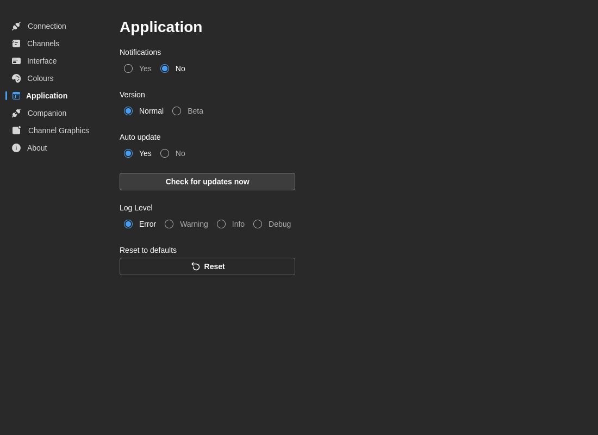

# Definições da aplicação

Configure o comportamento da aplicação, atualizações e registo.

## Notificações

**Ativar notificações**
- **Predefinição:** Sim
- **Opções:** Sim / Não
- **Descrição:** Mostra notificações toast para erros, avisos e mensagens de sucesso

## Canal de versão

Escolha que atualizações receber:

- **Normal** — Apenas versões estáveis (recomendado para produção)
- **Beta** — Acesso antecipado a versões beta com novas funcionalidades

:::warning
As versões beta podem conter erros ou funcionalidades incompletas. Use o canal **Normal** em ambientes de produção.
:::

## Atualização automática

**Ativar atualização automática**
- **Predefinição:** Sim
- **Opções:** Sim / Não
- **Descrição:** Descarrega e instala atualizações automaticamente quando disponíveis

Quando ativada:
- As atualizações descarregam em segundo plano
- É notificado quando uma atualização está pronta
- Escolhe quando instalar (é necessário reiniciar)

**Verificação manual:**
- Clique em **Verificar Atualizações** para procurar manualmente
- Mostra um aviso "Atualizado" se não houver novidades
- Muda para o separador Acerca se existir uma atualização

## Nível de registo

Controle a verbosidade dos registos da aplicação:

- **Erro** — Apenas erros críticos
- **Aviso** — Avisos e erros
- **Info** — Informação geral, avisos e erros (predefinição)
- **Debug** — Informação detalhada de depuração (verbosa)

**Quando usar:**
- **Produção:** **Info** ou **Aviso**
- **Resolução de problemas:** **Debug** para diagnósticos detalhados
- **Desenvolvimento:** **Debug**

## Acerca

A secção **Acerca** das Definições inclui:

- Uma ligação para o site da documentação (este site)
- Um contacto WhatsApp para suporte direto
- Versão da aplicação e informação da compilação

As ligações externas da secção Acerca abrem no seu navegador predefinido em vez de abrirem dentro da janela do 7CG.

## Repor predefinições

**Repor todas as definições**
- Repõe todas as preferências aos valores de fábrica
- **Nota:** Não apaga os seus rundowns nem o conteúdo da base de dados

:::danger
Repor as preferências obriga-o a reconfigurar a ligação ao CasparCG, os canais e todas as outras definições.
:::
