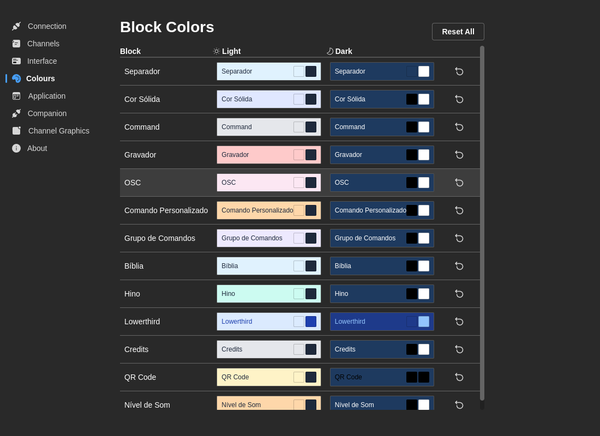

# Cores dos blocos

Personalize a aparência visual dos tipos de bloco do rundown com esquemas de cor separados para os temas claro e escuro.

## Personalização de cores

Cada tipo de bloco tem quatro propriedades de cor personalizáveis:

**Cores do tema claro:**
- **Cor de fundo** — Fundo do bloco no tema claro
- **Cor do texto** — Texto do bloco no tema claro

**Cores do tema escuro:**
- **Cor de fundo** — Fundo do bloco no tema escuro
- **Cor do texto** — Texto do bloco no tema escuro

## Tipos de bloco personalizáveis

Pode personalizar cores para todos os tipos de bloco disponíveis:

- Grupo de Comandos
- Comando
- Multimédia
- Oráculo (Lower Third)
- Ficha Técnica
- Bíblia
- Letras
- QR Code
- Ticker
- Info Canal
- Emergência

## Editar cores

1. Clique numa amostra de cor para abrir o seletor
2. Escolha a cor desejada com:
   - Seletor de cores
   - Introdução de hexadecimal
   - Valores RGB
3. As alterações são guardadas automaticamente

**Ações:**
- **Repor** (por bloco) — Repor as cores de um bloco às predefinições
- **Repor tudo** — Repor as cores de todos os blocos às predefinições

:::tip Dica de design
Use esquemas de cores consistentes entre tipos de bloco relacionados. Por exemplo, todos os blocos gráficos (oráculos, ficha técnica) podem usar tons de azul, enquanto blocos de conteúdo (Bíblia, letras) usam tons de roxo.
:::
