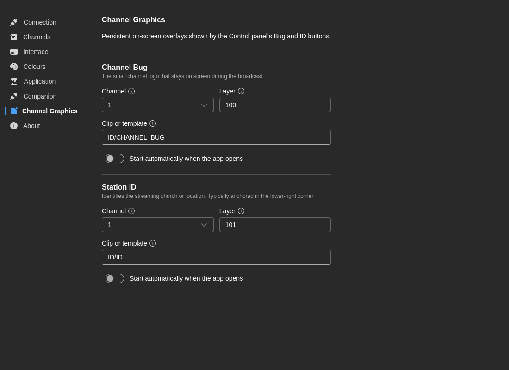

# Info Canal

O separador **Info Canal** configura sobreposições persistentes do canal, como a mosca e o ID da estação ou do programa.

Estas definições substituem a antiga ideia de uma página separada de "Arranque". As opções de sobreposição relacionadas com o arranque vivem agora aqui e no assistente de primeira execução.

## Tipos de gráfico disponíveis

O 7CG expõe atualmente dois gráficos de canal:

- **Mosca** — Habitualmente um logótipo num canto do ecrã
- **ID** — Habitualmente um identificador maior da estação, canal ou evento

Cada gráfico pode ser configurado de forma independente.

## Definições por gráfico

Para a **Mosca** e o **ID** pode configurar:

- **Canal** — Que canal CasparCG deve reproduzir a sobreposição
- **Camada** — Que camada CasparCG é usada
- **Ficheiro** — O caminho do template ou media a carregar
- **Início automático** — Se o gráfico deve começar automaticamente ao iniciar o 7CG

## Comportamento no arranque

Se o início automático estiver ativado, o 7CG pode colocar o gráfico no ar automaticamente quando a aplicação arranca.

Útil para:

- Uma mosca permanente em direto
- Um ID de canal predefinido usado durante todo o programa
- Gráficos de confiança que devem ser restaurados sem intervenção manual

Use o início automático com cuidado em ambientes de ensaio ou teste, especialmente se o 7CG se ligar a um servidor em direto no arranque.

## Integração com o assistente

O assistente de primeira execução inclui interruptores rápidos para:

- **Iniciar mosca do canal automaticamente**
- **Iniciar ID do canal automaticamente**

Essas opções alimentam o mesmo comportamento documentado aqui. Após a configuração, esta página é o local certo para refinar canais, camadas e caminhos de ficheiro.

## Configuração típica

### Mosca

- **Canal:** Canal de saída do programa
- **Camada:** Uma camada de sobreposição dedicada acima da reprodução de vídeo
- **Ficheiro:** O seu template ou recurso gráfico de mosca
- **Início automático:** Ativado se a mosca deve estar sempre presente

### ID

- **Canal:** Canal de programa ou clean-feed, conforme o fluxo
- **Camada:** Separada da mosca se ambas puderem aparecer juntas
- **Ficheiro:** Gráfico de ID da estação ou evento
- **Início automático:** Ativado apenas se o ID deve aparecer por predefinição

## Boas práticas

- Reserve camadas CasparCG fixas para sobreposições de mosca e ID
- Documente as camadas escolhidas para que não entrem em conflito com oráculos ou outros elementos CG
- Teste o início automático após qualquer alteração ao template ou caminho
- Mantenha consistência na nomenclatura dos ficheiros entre instalações

## Páginas relacionadas

- [Início rápido](../quickstart)
- [Ligação](./connection)
- [Canais](./channels)
- [Integração com o Companion](./companion)
