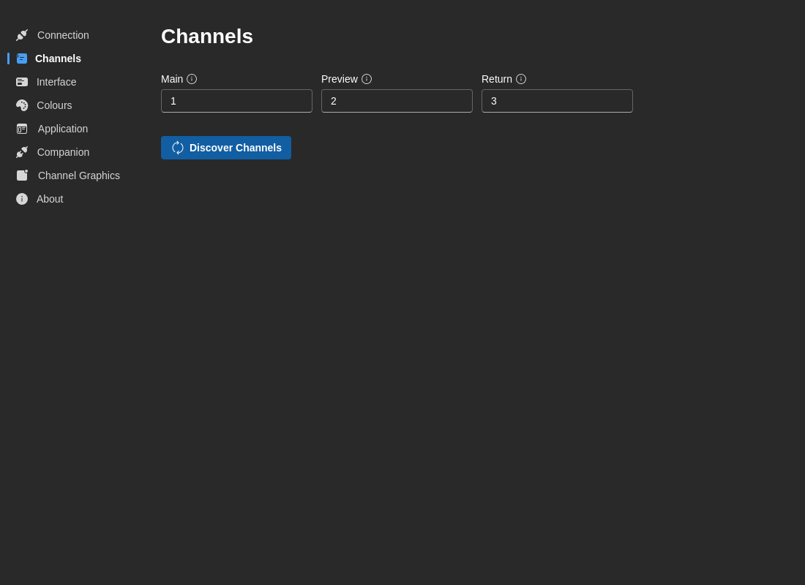

# Canais

Faça a gestão da configuração de canais CasparCG e das atribuições predefinidas.

## Atribuições predefinidas

Configure que canais usar para diferentes saídas:

**Canal principal**
- **Predefinição:** `1`
- **Descrição:** Canal de saída primário para os gráficos do programa
- **Caso de uso:** A sua saída principal de transmissão

**Canal de pré-visualização**
- **Predefinição:** `2`
- **Descrição:** Canal de pré-visualização/monitor para rever conteúdo antes de ir ao ar
- **Caso de uso:** Saída de pré-visualização fora do ar

**Canal de retorno**
- **Predefinição:** `3`
- **Descrição:** Canal de feed de retorno ou saída auxiliar
- **Caso de uso:** Monitores de confiança, retornos ou saída de backup

## Descoberta de canais

Descubra e configure automaticamente canais a partir do servidor CasparCG ligado.

**Como descobrir canais:**

1. Garanta que está **ligado** ao servidor CasparCG (separador Ligação)
2. Clique no botão **Descobrir Canais**
3. O 7CG consulta o servidor para os canais disponíveis e respetivas propriedades
4. Escolha como tratar os canais descobertos:
   - **Combinar** — Manter os nomes personalizados existentes, atualizar metadados
   - **Substituir** — Substituir todos os canais pelos descobertos

## Tabela de canais guardados

Veja e faça a gestão das suas configurações de canal guardadas:

**Propriedades do canal:**
- **Número do canal** — O número do canal CasparCG (começa em 1)
- **Nome personalizado** — A sua etiqueta personalizada para este canal (ex.: "Programa", "Pré-visualização")
- **Modo de vídeo** — Formato de vídeo configurado no canal (ex.: "1080p5000", "720p5000")
- **Taxa de imagens** — Taxa detetada (se disponível)
- **Estado** — Ativar/desativar canais
- **Data de descoberta** — Quando o canal foi descoberto pela última vez

**Ações:**
- **Editar** — Renomear ou modificar propriedades do canal
- **Apagar** — Remover canal da lista guardada
- **Alternar** — Ativar ou desativar o canal

:::info
As informações dos canais descobertos incluem dados de modo de vídeo e taxa de imagens dos comandos INFO CONFIG e INFO CHANNEL do CasparCG.
:::

## Resolução de problemas

### Não foram descobertos canais

1. Garanta que está ligado ao CasparCG (verifique o separador Ligação)
2. Confirme que a configuração do CasparCG inclui definições de canais
3. Verifique que os canais estão devidamente configurados em `casparcg.config`
4. Tente criar canais manualmente através do botão Editar
