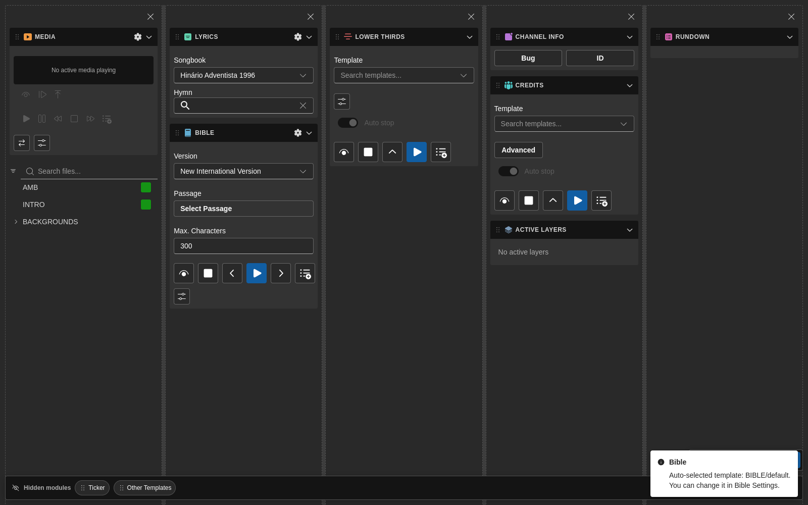
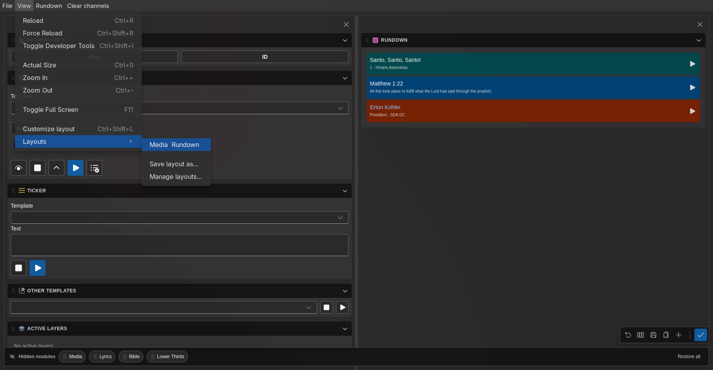

# Layouts

O 7CG inclui um espaço de trabalho personalizável para que os operadores possam reorganizar os módulos principais de acordo com o fluxo de produção.

## O que pode personalizar

No modo de edição de layout pode:

- Arrastar módulos entre colunas
- Reordenar módulos dentro de uma coluna
- Adicionar e remover colunas
- Redimensionar colunas
- Ocultar módulos temporariamente arrastando-os para a barra de módulos ocultos
- Restaurar módulos ocultos
- Repor o espaço de trabalho ao layout predefinido
- Distribuir todas as colunas de igual forma

## Entrar no modo de edição

Use os controlos de personalização no espaço de trabalho principal para entrar em modo de edição.

Quando o modo de edição está ativo, o 7CG mostra:

- Pegas para arrastar módulos
- Controlos de remoção de coluna
- Alvos para soltar módulos em colunas vazias
- Uma barra flutuante com ações de layout
- Uma barra de módulos ocultos para remover temporariamente módulos do espaço visível

Os módulos arrastados para fora caem na barra de módulos ocultos ao lado, onde aguardam até serem arrastados de volta:

## Predefinições de layout guardadas

Versões recentes do 7CG suportam **predefinições de layout nomeadas**.

Útil quando quer espaços de trabalho diferentes para:

- Ensaio versus culto em direto
- Culto matutino versus concerto
- Operador de gráficos versus operador de letras
- Operação compacta em portátil versus configurações multi-monitor

## Guardar um layout

Pode guardar a disposição atual a partir de:

- A barra de edição de layout
- **Vista → Layouts** no menu da aplicação

Ao guardar, dê ao layout um nome claro como:

- `Domingo Manhã`
- `Operador de Letras`
- `Portátil Compacto`

Se guardar com um nome existente, o 7CG pergunta se quer substituir a predefinição.

## Gerir layouts

A janela **Gerir layouts** permite:

- Aplicar um layout guardado
- Renomear uma predefinição
- Apagar uma predefinição

O menu da aplicação atualiza-se dinamicamente à medida que adiciona ou remove predefinições, para que os operadores troquem de layout rapidamente.

## Fluxo recomendado

1. Ative apenas os módulos de que precisa em [Interface](./interface)
2. Entre no modo de edição de layout
3. Organize os módulos em colunas focadas na tarefa
4. Oculte módulos só usados ocasionalmente
5. Guarde o resultado como predefinição nomeada
6. Repita para cada função de operador ou tipo de programa

## Boas práticas

- Mantenha o módulo **Rundown** suficientemente largo para etiquetas, estado e ações de blocos
- Agrupe módulos relacionados, como **Louvor + Bíblia** ou **Info Canal + Ficha Técnica**
- Guarde uma predefinição de fallback semelhante ao layout predefinido
- Crie predefinições simples para voluntários e mais detalhadas para operadores técnicos

## Repor

Use **Repor** se o layout atual ficar confuso ou se quiser começar de novo a partir do espaço de trabalho predefinido.

:::warning
Repor o layout atual devolve o espaço de trabalho às predefinições. Guarde uma predefinição primeiro se quiser manter a sua disposição personalizada.
:::
