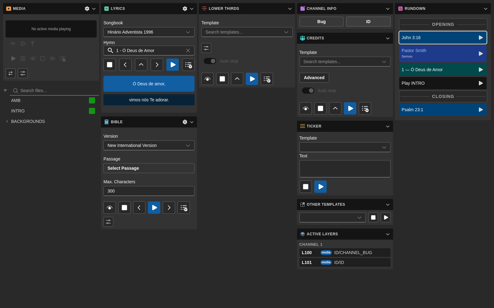

# Módulo Info Canal

O módulo **Info Canal** é a superfície de controlo em direto do 7CG para sobreposições persistentes do canal, como os gráficos de **Mosca** e **ID** no ar.

Combina:

- Interruptores rápidos para sobreposições de Mosca e ID
- Transições de fade partilhadas para ações de ligar/desligar
- Comportamento de início automático no arranque
- Separação clara entre configuração guardada e estado em tempo real
- Transmissão de estado para o Companion

## Visão geral

O módulo Info Canal permite-lhe:

- Ligar e desligar a sobreposição **Mosca**
- Ligar e desligar a sobreposição **ID**
- Usar o canal, camada e ficheiro guardados sem reabrir a configuração
- Confiar nas definições de início automático para restaurar sobreposições no arranque
- Manter o Companion e a UI alinhados com a atividade atual de mosca e ID

Este módulo é intencionalmente simples. É para operação em direto, não para escolher ficheiros ou editar detalhes de encaminhamento. A configuração acontece em **Configuração → Info Canal**, enquanto este módulo é onde os operadores disparam as sobreposições durante a produção.

## Componentes da interface

### Interruptor da Mosca

O interruptor **Mosca** liga ou desliga a sobreposição configurada da mosca.

Quando ativado, o 7CG envia o ficheiro de media configurado para o canal e camada guardados da mosca. Quando desativado, o 7CG limpa essa camada reproduzindo `EMPTY`.

### Interruptor do ID

O interruptor **ID** funciona da mesma forma para a sobreposição configurada de ID do canal ou do programa.

Tal como o da Mosca, usa os valores guardados de canal, camada e ficheiro, e limpa a camada com `EMPTY` quando desligado.

### Sem configuração inline

O módulo não expõe:

- Navegação por ficheiros
- Seleção de templates
- Janelas avançadas de encaminhamento
- Criação de itens de rundown

Essas escolhas estão já definidas na página de configuração de Info Canal. O módulo destina-se a manter-se rápido e previsível para uso em direto.

## Comportamento de reprodução

Ambos os interruptores usam um fluxo `media/play` em vez de um fluxo de template CG.

### Ligar um gráfico

Quando uma sobreposição é ativada, o 7CG envia:

- O `canal` guardado
- A `camada` guardada
- O `ficheiro` guardado
- Uma transição `MIX`

### Desligar um gráfico

Quando uma sobreposição é limpa, o 7CG envia o mesmo destino com:

- O `canal` guardado
- A `camada` guardada
- O clipe definido como `EMPTY`
- A mesma transição `MIX`

### Tempo do fade

O módulo deriva a duração do fade da taxa de imagens guardada do canal `1`.

Se não houver taxa disponível, o 7CG recorre a `50` fps. Na prática, isso significa que o fade predefinido dura aproximadamente um segundo.

## Modelo de configuração

O módulo lê as suas definições do armazenamento de Info Canal, com blocos separados para **Mosca** e **ID**.

Cada gráfico armazena:

- `canal`
- `camada`
- `ficheiro`
- `início automático`

As predefinições atuais são:

- **Mosca**: canal `1`, camada `100`, ficheiro `ID/CHANNEL_BUG`, início automático `falso`
- **ID**: canal `1`, camada `101`, ficheiro `ID/ID`, início automático `falso`

Em instalações antigas, o início automático ainda recorre às chaves de arranque legadas:

- `startup.autoplayBug`
- `startup.autoplayId`

Mantém as instalações existentes a funcionar enquanto as definições mais recentes vivem na área de configuração de Info Canal.

## Comportamento no arranque

Após o armazenamento de Info Canal terminar o bootstrap, o 7CG verifica se a **Mosca** ou o **ID** têm início automático ativado.

Se estiver ativado, o módulo coloca essa sobreposição no ar uma vez durante o arranque, após um pequeno atraso de cerca de um segundo.

Útil para:

- Uma mosca permanente em direto
- Um ID de estação predefinido
- Recuperação rápida após reiniciar o 7CG durante um dia de produção

## Estado em tempo real e Companion

O 7CG mantém o estado em direto separado da configuração guardada.

### Configuração guardada

Definições persistentes, como caminho do ficheiro, canal, camada e início automático, vivem no armazenamento de configuração de Info Canal.

### Estado em tempo real

Os booleanos no ar para **Mosca** e **ID** vivem num armazenamento separado de runtime. Permite que a UI e o Companion reajam ao que está ativo sem tratar uma alteração de definições como uma alteração de estado no ar.

O módulo Info Canal participa na transmissão de estado ao Companion para que superfícies de controlo externas possam refletir se a sobreposição da Mosca ou do ID está atualmente ativa.

## Fluxo típico

### Configuração inicial

1. Abra **Configuração → Info Canal**
2. Defina canal, camada, ficheiro e início automático para **Mosca**
3. Defina canal, camada, ficheiro e início automático para **ID**
4. Teste as duas sobreposições uma vez a partir do módulo

### Operação em direto

1. Use o interruptor **Mosca** para colocar ou retirar a mosca do ar
2. Use o interruptor **ID** para colocar ou retirar o ID do ar
3. Deixe o início automático restaurar qualquer sobreposição automaticamente no arranque, quando necessário

## Boas práticas

- Reserve camadas fixas para Mosca e ID para que não colidam com oráculos ou outras sobreposições
- Mantenha mosca e ID em camadas separadas se ambas puderem ser usadas na mesma produção
- Ative o início automático apenas para sobreposições que devam aparecer fiavelmente em todos os arranques
- Confirme as definições de taxa de imagens do canal `1` para que o fade corresponda ao seu ambiente
- Trate este módulo como um painel de operador e mantenha todas as alterações de ficheiro e encaminhamento na página de configuração

## Páginas relacionadas

- [Visão geral dos módulos](./)
- [Configuração de Info Canal](../configuration/channel-graphics)
- [Início rápido](../quickstart)
- [Canais](../configuration/channels)
