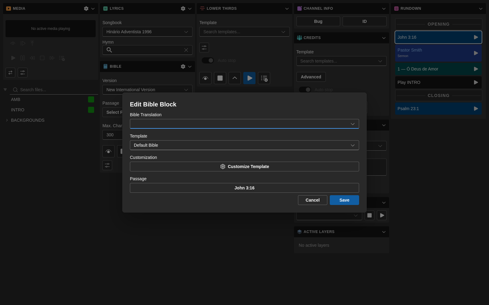
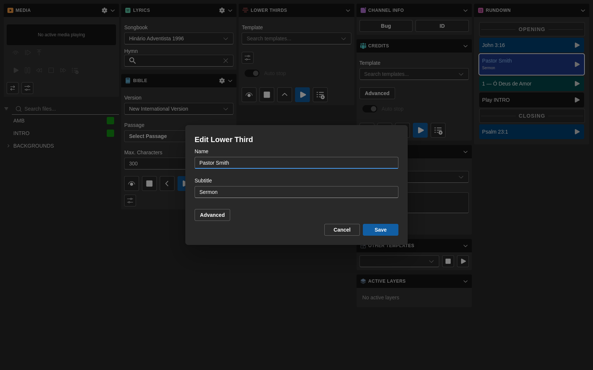
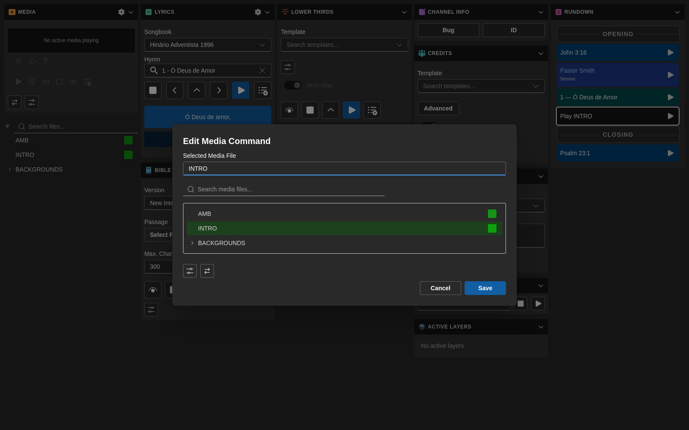
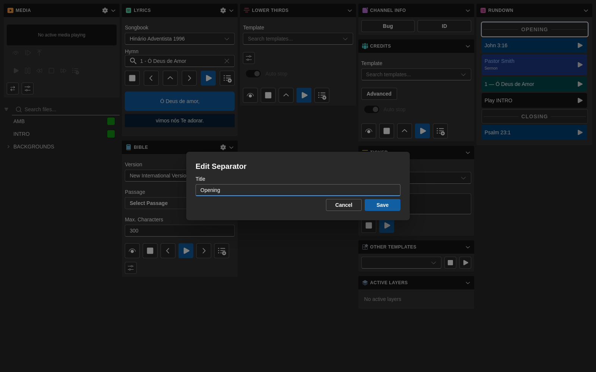
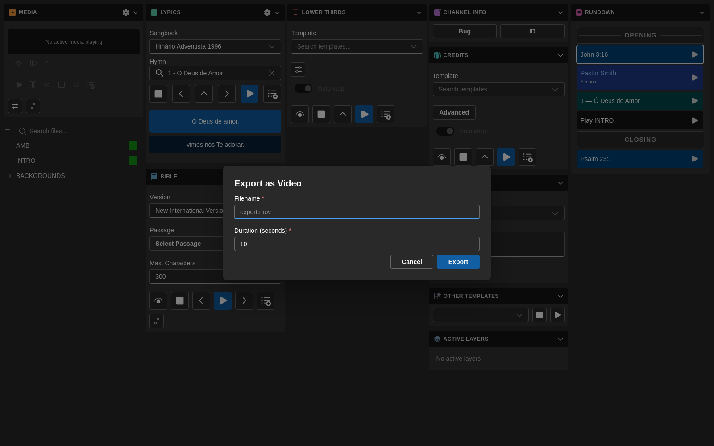

# Módulo Rundown

O módulo **Rundown** é onde organiza e executa a sequência de itens de uma produção em direto.

É também a origem de vários fluxos mais recentes no `7cg-ng`, incluindo a execução de itens específicos a partir do Companion e a exportação para vídeo.

## O que faz o Rundown

O rundown permite-lhe:

- Organizar os itens do programa por ordem
- Selecionar o item atual
- Executar e parar itens compatíveis
- Acompanhar a posição atual e a seguinte
- Editar etiquetas e detalhes dos itens
- Disparar blocos a partir do Companion
- Exportar itens compatíveis para vídeo

## Fluxo típico

1. Adicione ou crie os itens necessários
2. Organize-os pela ordem de produção
3. Selecione o próximo item a ir ao ar
4. Execute-o a partir do 7CG ou do Companion
5. Pare ou limpe quando apropriado
6. Continue para o próximo item

## Edição

### Anular e refazer

As alterações ao rundown — adicionar, remover, reordenar ou editar blocos — são registadas num histórico de anulação.

- **Anular:** `Ctrl+Z` (`Cmd+Z` no macOS)
- **Refazer:** `Ctrl+Shift+Z`

### Transições por bloco

Cada bloco pode usar o seu próprio tipo e duração de transição, configurados na janela de edição do bloco. Os ícones e etiquetas das transições são traduzidos, pelo que os operadores veem os mesmos nomes no idioma escolhido.

Se um bloco não tiver substituição, é usada a transição predefinida do canal.

### Janelas de edição por bloco

Vários tipos de bloco têm agora janelas de edição dedicadas:

- Os blocos de **Hino** expõem uma substituição "linhas por ecrã" por bloco, para que um único hino possa quebrar de forma diferente da definição global de Louvor (veja também o [módulo Louvor](./lyrics)).

- Os blocos de **Comando** têm a sua própria janela de edição com gestão de media, para que os ficheiros de media sejam escolhidos e pré-visualizados no mesmo sítio que o comando.
- Os blocos de **Oráculo** têm uma janela de edição focada nos campos de nome e subtítulo, com uma secção Avançado para ajustes de transição e encaminhamento.
- Os blocos de **Bíblia** permitem definir propriedades de template por bloco, sobrepondo as predefinições do módulo só naquele momento do rundown (veja também o [módulo Bíblia](./bible)).
- Os blocos de **Separador** editam apenas o campo Título — são marcadores visuais de secção no rundown, não blocos de reprodução.

### Ações por bloco

Clique com o botão direito em qualquer linha do rundown para abrir o menu de contexto — Definir etiqueta, Editar, Apagar, Duplicar, Exportar vídeo e Cor estão disponíveis por bloco.

## Integração com o Companion

Versões recentes do 7CG expõem mais funcionalidades do Companion conscientes do rundown.

### Ações sobre o item selecionado

Estas ações operam sobre o item selecionado no 7CG:

- Executar item selecionado
- Parar item selecionado
- Selecionar próximo item
- Selecionar item anterior

### Ações sobre item específico

O 7CG expõe também ações Companion que apontam para um **item específico do rundown por ID**:

- **Executar item do rundown…**
- **Parar item do rundown…**

Úteis quando um botão deve disparar sempre o mesmo item, independentemente do que está selecionado na UI.

Como a associação usa um ID estável, renomear ou reordenar o item não quebra o botão. Se o item for removido do rundown, o Companion recebe um erro claro "não encontrado" em vez de falhar silenciosamente.

## Transmissão do estado do rundown

O 7CG publica o estado do rundown para o Companion para que painéis e feedbacks se mantenham sincronizados:

- Item atual
- Próximo item
- Índice da posição atual
- Total de itens
- Lista completa de itens para listas pendentes de ações

Isto facilita a construção de páginas Companion claras para o operador, sem ter de codificar etiquetas manualmente.

## Exportar vídeo

O módulo Rundown pode exportar itens compatíveis como um ficheiro `.mov`.

### Fluxo de exportação

Ao exportar um item:

1. Escolha um nome de ficheiro terminado em `.mov`
2. Defina a duração em segundos
3. Confirme o canal alvo, se aplicável
4. Inicie a exportação
5. Acompanhe a barra de progresso e o tempo restante
6. Use **Parar** se precisar de cancelar a exportação a meio

### O que acontece durante a exportação

O 7CG faz mais do que um simples "tocar e gravar":

- É adicionado um pequeno preroll antes da reprodução
- É gravado um final após o stop para capturar transições corretamente
- A janela mantém-se aberta durante a gravação para evitar sessões de gravador órfãs
- As exportações de Bíblia e hino podem ciclar pelos seus trechos ou grupos de versículos durante a duração da exportação, em vez de permanecerem só no primeiro

### Cancelar uma exportação

Se foi escolhido o item, duração ou nome errado, use o botão **Parar** na janela de exportação. O 7CG cancela a gravação e faz a limpeza necessária para que o CasparCG não continue a gravar em segundo plano.

## Boas práticas

- Mantenha as etiquetas claras para que operadores e utilizadores Companion as reconheçam rapidamente
- Agrupe itens relacionados pela ordem em que vão para o ar
- Teste exportações com antecedência para templates que dependam de vários trechos ou versículos
- Use cores de bloco para tornar a leitura do rundown mais rápida sob pressão

## Páginas relacionadas

- [Integração com o Companion](../configuration/companion)
- [Cores dos blocos](../configuration/block-colors)
- [Módulo Multimédia](./media)
