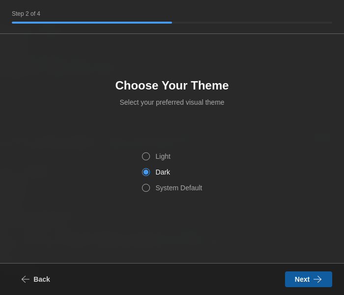
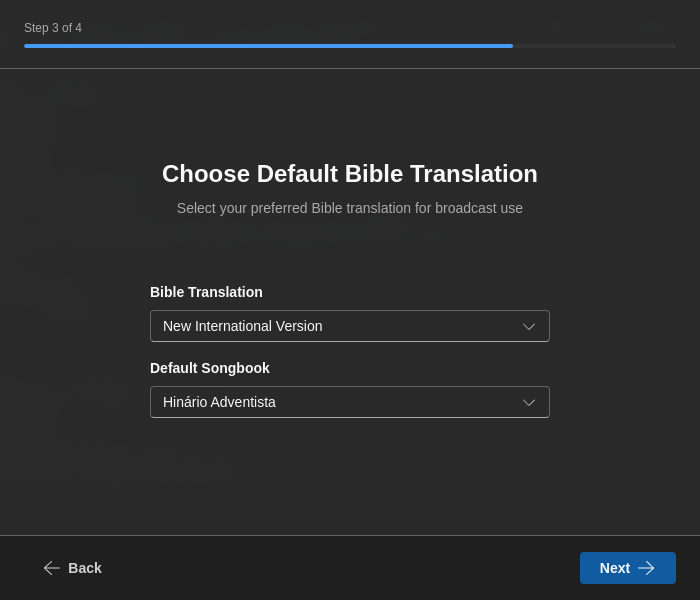

# Início rápido

Comece a usar o 7CG em poucos minutos.

## Instalação

1. Descarregue o 7CG a partir do [site oficial](https://7cg.live)
2. Instale a aplicação para a sua plataforma (Windows, macOS ou Linux)
3. Inicie o 7CG

## Assistente de primeira execução

Quando inicia o 7CG pela primeira vez, um assistente de configuração guia-o pelos passos iniciais.

### 1. Boas-vindas

O assistente dá-lhe as boas-vindas ao 7CG. Clique em **Começar** para iniciar a configuração.

{/* Screenshot: Welcome screen */}

### 2. Escolha do idioma

Escolha o idioma preferido para a interface:
- English
- Português
- Español

A escolha é aplicada de imediato e é usada para pré-filtrar a lista de traduções da Bíblia mais à frente no assistente.

{/* Screenshot: Language selection screen */}

### 3. Ligação ao CasparCG

Configure a ligação ao servidor CasparCG usado pelo 7CG:

- **IP / nome do servidor** — por exemplo `127.0.0.1`, `localhost`, ou o nome da máquina onde o CasparCG está a correr
- **Porta do servidor** — porta AMCP, normalmente `5250`
- **Testar ligação** — verifica se o servidor está acessível antes de continuar

Se ainda não estiver pronto para se ligar, pode saltar este passo e configurá-lo mais tarde em **Definições → Ligação**.

{/* Screenshot: Theme selection screen */}

### 4. Escolha do tema

Escolha o tema visual preferido:
- **Claro** — esquema de cores claro
- **Escuro** — esquema de cores escuro
- **Sistema** — segue o tema do sistema operativo

### 5. Bíblia e Hinário

Configure as fontes de conteúdo predefinidas:

- **Tradução da Bíblia** — selecione a versão preferida (filtrada pelo idioma escolhido)
- **Hinário** — escolha o hinário predefinido para as letras

{/* Screenshot: Bible and Songbook selection screen */}

### 6. Outras preferências

O último passo do assistente regista algumas predefinições operacionais:

- **Notificações** — ativa notificações de ambiente de trabalho para atualizações, importações e mensagens de estado importantes
- **Iniciar mosca do canal automaticamente** — inicia a sobreposição da mosca quando o 7CG arranca
- **Iniciar ID do canal automaticamente** — inicia a sobreposição do ID do canal quando o 7CG arranca

Estas sobreposições de arranque são configuradas em detalhe mais tarde em **Definições → Info Canal**.

{/* Screenshot: Other preferences screen */}

## Depois do assistente

Quando a configuração termina, o 7CG abre a aplicação principal e pode refinar as suas preferências no painel de definições:

- **Ligação** — endereço do CasparCG, porta AMCP, porta OSC
- **Canais** — descobrir e identificar canais do CasparCG
- **Interface** — tema, idioma e visibilidade dos módulos
- **Companion** — ativar o servidor e emparelhar dispositivos com PIN
- **Info Canal** — configurar as sobreposições de mosca e ID, alvos de canal/camada e início automático
- **TV Manager** — integração com o rundown na nuvem

## Ligar ao CasparCG mais tarde

Se saltou o teste de ligação durante o assistente:

1. Abra **Definições**
2. Navegue até **Ligação**
3. Introduza os dados do servidor CasparCG:
   - Endereço, por exemplo `localhost` ou `192.168.1.100`
   - Porta, normalmente `5250`
4. Clique em **Ligar**
5. Abra **Canais** para confirmar que o 7CG consegue descobrir e identificar corretamente os canais do servidor

Consulte o guia de [Configuração da ligação](./configuration/connection) para instruções detalhadas.

## Tarefas opcionais de configuração

Antes da sua primeira produção em direto, vale a pena rever três áreas:

- [Info Canal](./configuration/channel-graphics) para configurar as sobreposições de mosca e ID no arranque
- [Integração com o Companion](./configuration/companion) para emparelhar dispositivos Stream Deck ou Companion
- [Layouts](./configuration/layouts) para personalizar o espaço de trabalho para cada operador ou tipo de produção

## Criar o primeiro rundown

Uma vez ligado ao CasparCG:

1. Abra ou crie um rundown no módulo **Rundown**
2. Adicione blocos a partir dos módulos ou das ações de criação do rundown
3. Configure o conteúdo e o encaminhamento
4. Selecione um item e prima **Reproduzir** para o executar
5. Use **Parar** quando o tipo de bloco suportar parar ou limpar a saída no ar

Para mais detalhes, veja o [Módulo Rundown](./modules/rundown) e a secção [Configuração](./configuration/).

## Passos seguintes

- Explore as [opções de configuração](./configuration/) para personalizar o seu fluxo de trabalho
- Conheça os [módulos](./modules/) disponíveis para diferentes tipos de conteúdo
- Consulte a [resolução de problemas](./configuration/troubleshooting) se encontrar dificuldades
